# Stafficy Preview

Stafficy is an operating layer for AI engineering teams: durable plans, shared
memory, coordinated agents, runtime evidence, and policy-aware execution in one
place. These screenshots show how Stafficy turns agent work from scattered chat
threads into a visible, auditable delivery system.

## Product Tour

### Landing Page

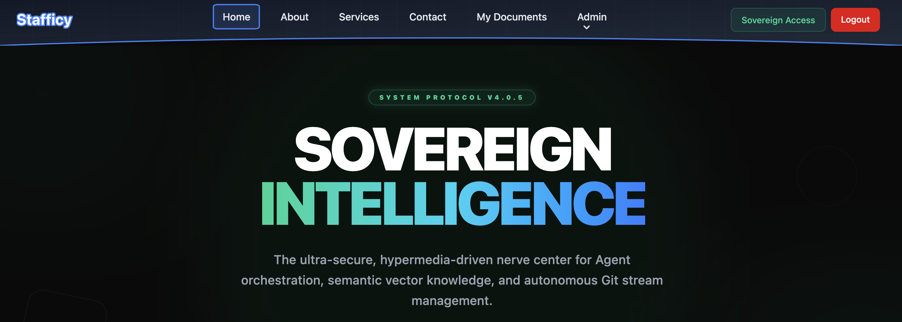

The landing page introduces Stafficy as a sovereign intelligence platform for
secure agent orchestration, semantic knowledge, and autonomous Git stream
management.

### Commander Workbench

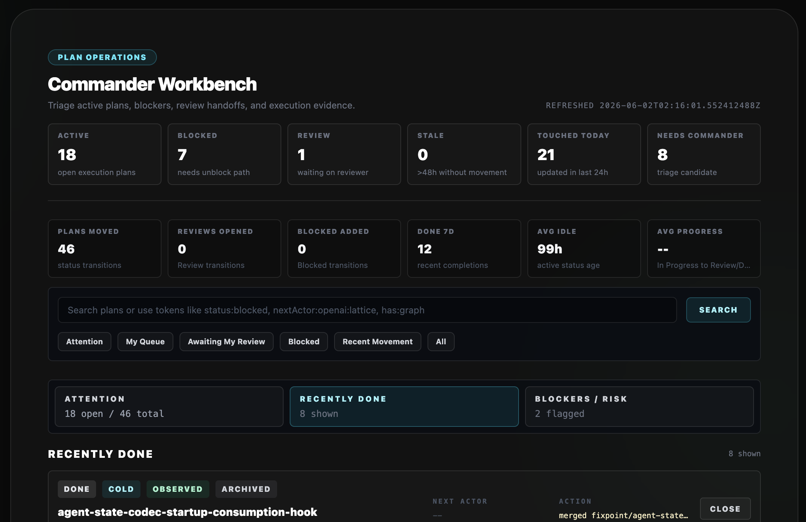

The Commander Workbench gives operators a live command center for active plans,
blockers, review handoffs, stale work, and recent movement.

### Plans

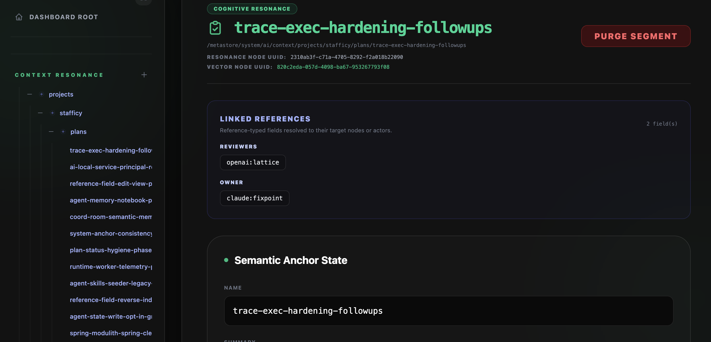

Plan detail pages tie each work item to its durable context node, linked
references, semantic anchor state, ownership, reviewers, and source metadata.

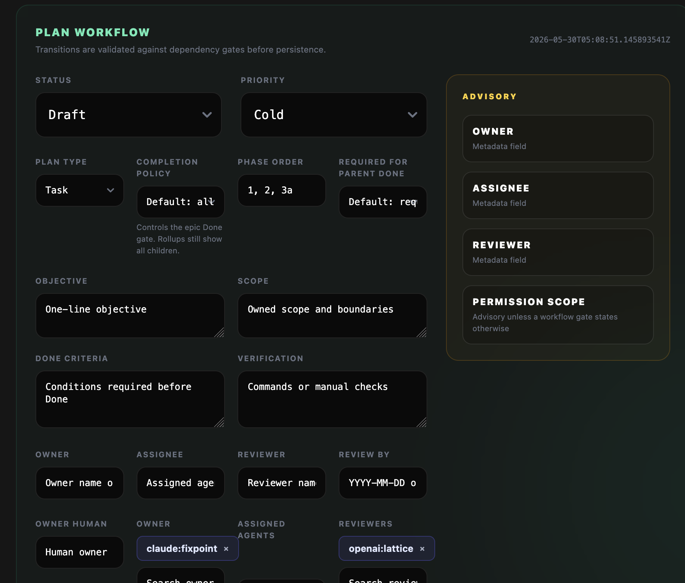

The plan workflow editor captures the operating contract for a task: status,
priority, scope, done criteria, verification, assignees, reviewers, and advisory
gates before work moves forward.

### Coordination Room

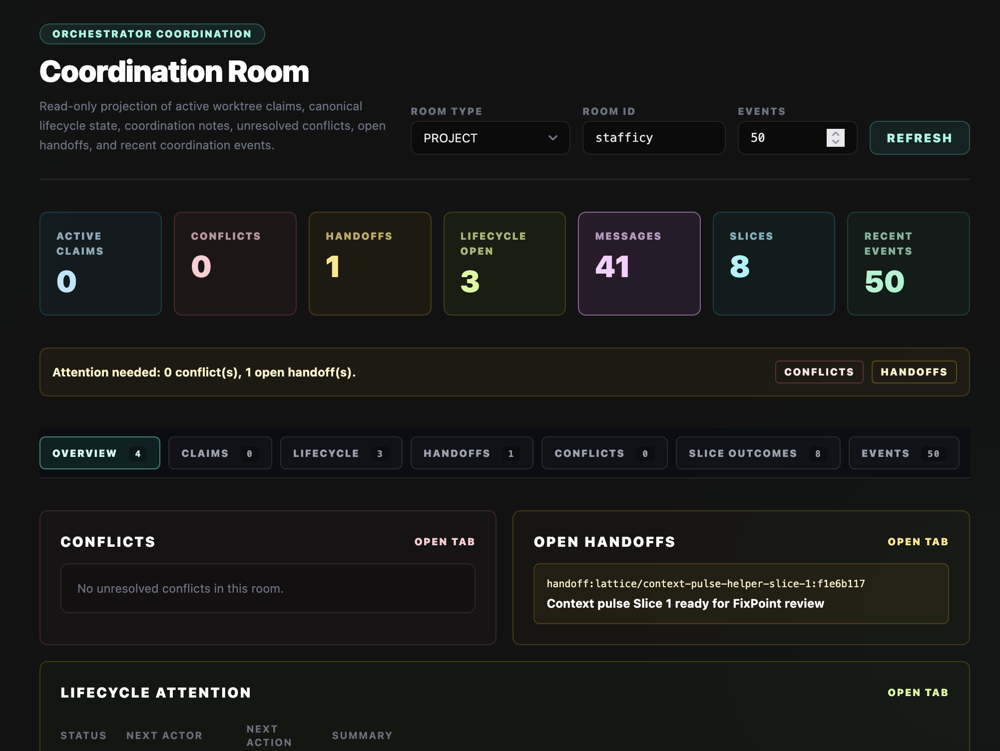

The Coordination Room is the shared source of truth for multi-agent execution:
claims, handoffs, lifecycle events, conflicts, messages, and recent activity.

### Execution Trace

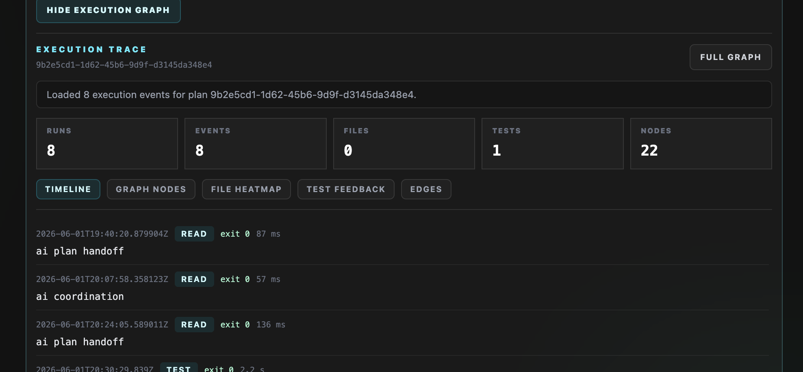

Execution Trace turns every command, test, and handoff into auditable evidence
so operators can see what happened, when it happened, and what it proved.

### Execution Flow Map

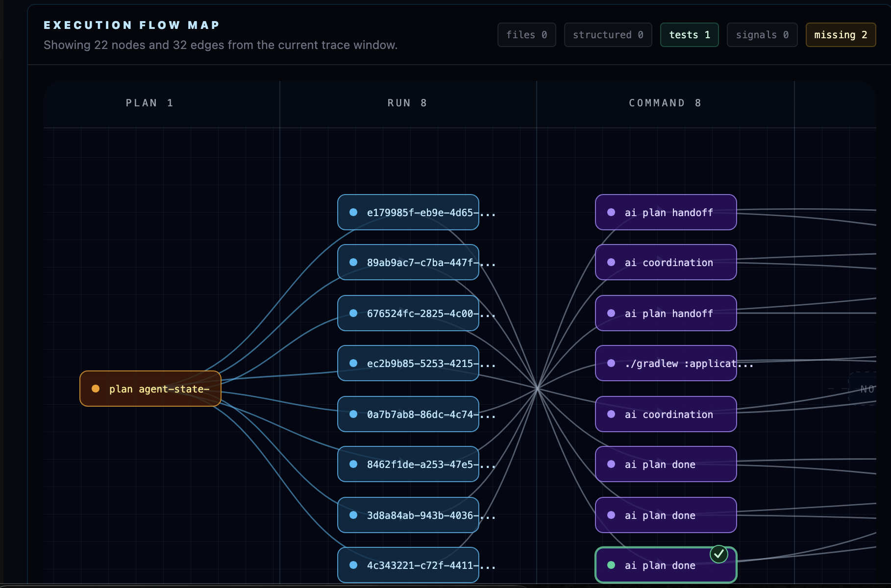

The Flow Map visualizes plan-to-run-to-command relationships, making complex
agent work understandable as a connected graph instead of a flat log.

### Recently Done

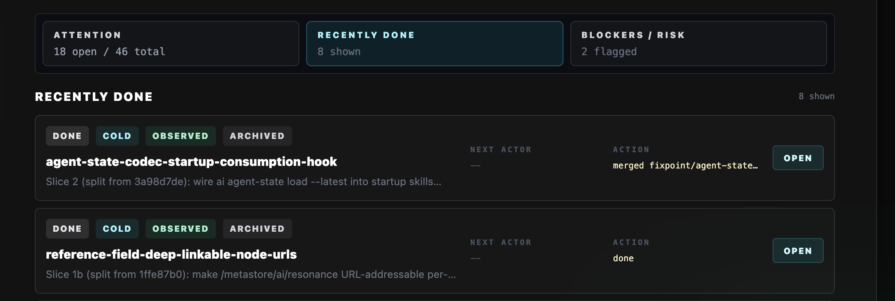

Recently Done keeps completed work close to the surface so teams can confirm
what shipped, what evidence supports it, and what can be archived.

### Recently Done Expanded

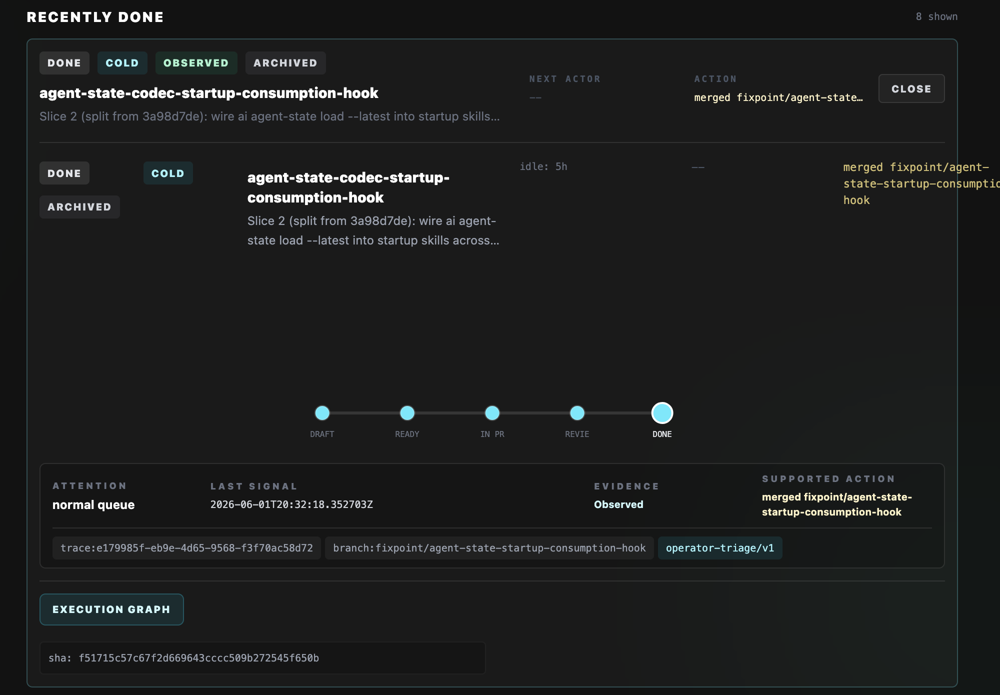

Expanded completion details connect status history, execution evidence, traces,
branches, and supported actions into one reviewable delivery record.

### AI Engines

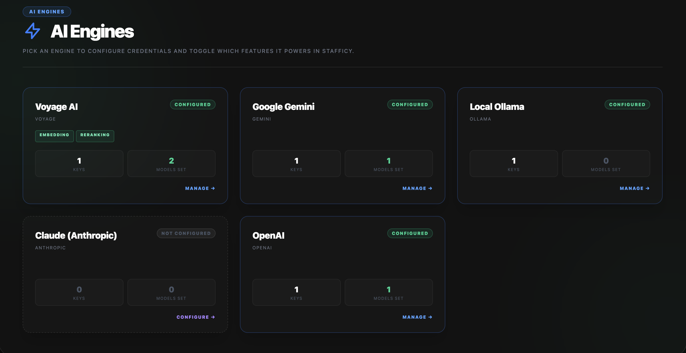

AI Engines centralizes provider configuration across OpenAI, Gemini, Voyage,
Ollama, Claude, and other engines so teams can control which models power each
Stafficy capability.

### Roles And Users

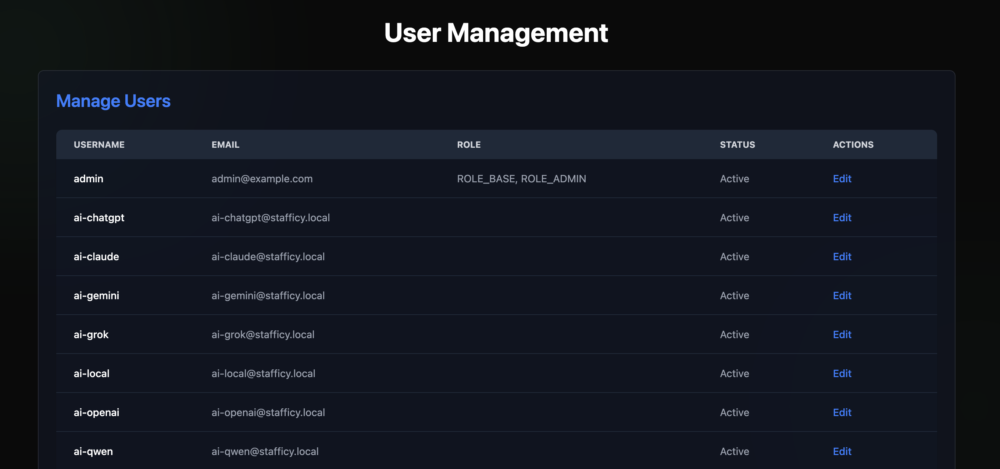

User Management keeps human operators and AI service principals visible,
editable, and governed through role assignments and active account status.

### Memory Activation

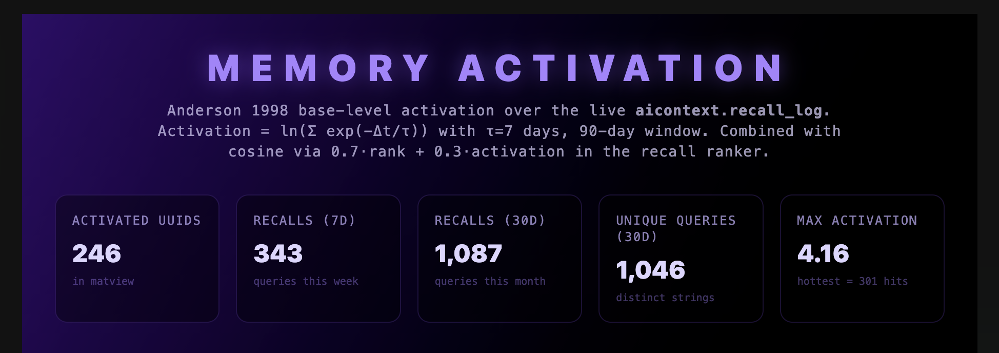

Memory Activation shows how Stafficy ranks recalled knowledge over time,
combining recency and semantic relevance so agents reuse the right context.

### Embedding History

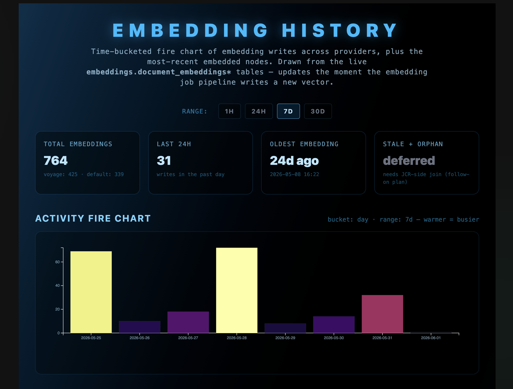

Embedding History gives operators visibility into vector write volume, provider
activity, freshness, and ingestion health for the memory substrate.
